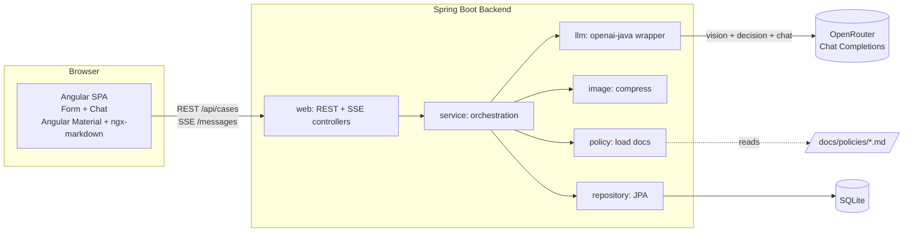
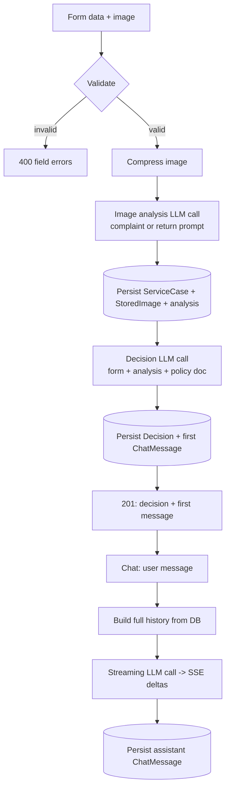
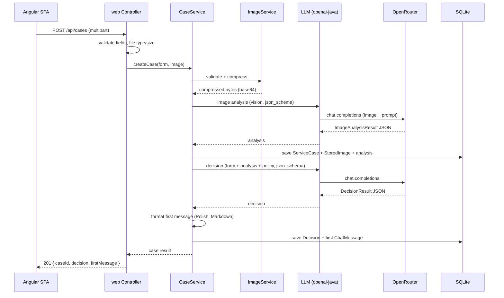
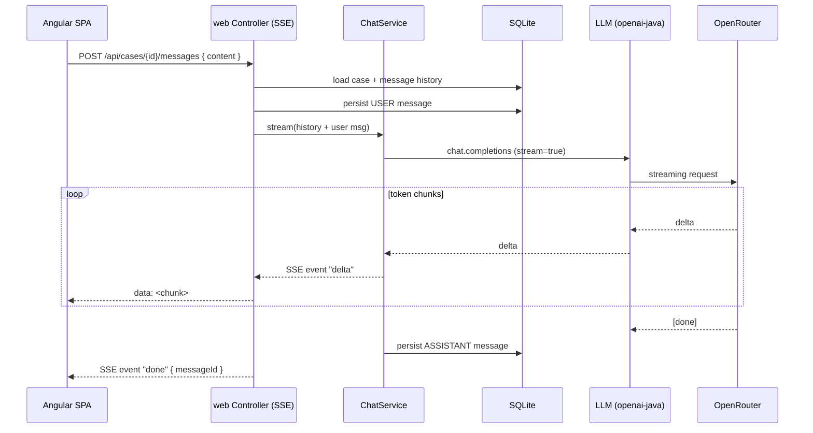

# ADR: Hardware Service Decision Copilot — Main Architecture

**Date:** 2026-06-24
**Status:** Accepted
**PRD:** [`docs/PRD-Product-Requirements-Document.md`](../PRD-Product-Requirements-Document.md)

---

## 1. Overview

Hardware Service Decision Copilot is a self-service web application that lets an end customer submit a hardware **complaint** (*reklamacja*) or **return** (*zwrot*) request with one photo, then receive an **advisory, non-binding decision** with justification, and continue the case in a streaming chat. This ADR defines the overall system: components, technology stack, module boundaries, data models, interface contracts, environment, cross-cutting decisions, and the testing strategy. Area-specific detail lives in the granular ADRs:

- [`001-backend-api.md`](001-backend-api.md) — REST/SSE API, services, request orchestration.
- [`002-llm-integration.md`](002-llm-integration.md) — OpenRouter via `openai-java`, prompts, structured output, streaming.
- [`003-frontend.md`](003-frontend.md) — Angular + Angular Material UI, form, chat, SSE consumption.
- [`004-database.md`](004-database.md) — SQLite + JPA schema and persistence.

This ADR realizes the PRD without changing its scope. All user-facing text is **Polish**; these documents are English.

---

## 2. Context7 Library References

Implementing agents MUST fetch docs via these handles instead of searching again.

| Library | Context7 Handle | Used for |
|---|---|---|
| OpenAI Java SDK | `/openai/openai-java` | LLM calls to OpenRouter (Chat Completions: vision, structured output, streaming) |
| Spring Boot | `/spring-projects/spring-boot` | Backend framework (REST, multipart, SSE, Data JPA, validation) |
| Angular | `/websites/angular_dev` | Frontend framework (standalone components, signals, reactive forms, HttpClient) |
| Angular Material | `/websites/material_angular_dev` | UI component library |

Additional libraries that need docs (resolve via `resolve-library-id` when first used): `ngx-markdown` (render agent Markdown), `thumbnailator` (server-side image compression), `sqlite-jdbc` + `hibernate-community-dialects` (SQLite + JPA). These are not yet pinned to a Context7 handle in this ADR.

---

## 3. System Architecture

### Architecture pattern
Two-process **SPA + REST/SSE backend**, developed as a monorepo. A stateless (per-process) Spring Boot service exposes a synchronous REST endpoint for case submission and an SSE endpoint for streaming chat. An Angular single-page app consumes both. A two-stage AI pipeline (multimodal image analysis → reasoning decision/chat) runs inside the backend and calls OpenRouter. Session state is persisted in a local SQLite database.

### Repository structure
```
app/
  backend/    Spring Boot (Maven, Java 21) — base package pl.nbp.copilot
  frontend/   Angular 20 workspace (Angular Material, ngx-markdown)
docs/
  PRD-Product-Requirements-Document.md
  policies/   return-policy.md, complaint-policy.md  (injected into prompts)
  ADR/        this folder
data/         SQLite database file (gitignored, created at runtime)
```
Frontend and backend build and run independently. In dev, the Angular dev server proxies `/api/**` to the backend to avoid CORS.

### Technology stack

| Layer | Technology | Reason |
|---|---|---|
| Backend | Java 21, Spring Boot 3.5.x, Maven | Chosen stack for the NBP edition; mature REST/SSE/JPA/validation support. |
| LLM access | `openai-java` SDK → OpenRouter Chat Completions API | Mature, OpenAI-compatible; confirmed vision + structured output + streaming; base-URL override targets OpenRouter. |
| LLM models | `openai/gpt-5.4-mini` for both image analysis and decision/chat (configurable per stage) | Vision-capable, supports reasoning effort, cost-effective for a PoC; model IDs are env-configurable. |
| Image processing | Thumbnailator | Simple, dependency-light server-side resize/recompress before sending to the LLM. |
| Persistence | SQLite + Spring Data JPA (Hibernate community dialect) | Single-file local DB; satisfies the "persist sessions and decisions" decision with minimal ops. |
| Frontend | Angular 20 (standalone, signals, reactive forms) | Chosen stack; strong forms and HttpClient story. |
| UI components | Angular Material 20 + `ngx-markdown` | Material primitives for form/chat; `ngx-markdown` renders the agent's formatted Polish output. |
| Streaming transport | Server-Sent Events (SSE) | One-way server→client token stream; simpler than WebSockets for chat. |

### Why Chat Completions, not the Responses API
OpenRouter's Responses API is **beta**, stateless, and does not document vision / structured-output / streaming support — the three features this product depends on. OpenRouter's Chat Completions API is the mature, fully OpenAI-compatible path with confirmed support for all three. See [`002-llm-integration.md`](002-llm-integration.md) §6 for the full decision record.

---

## 4. Module Structure & Dependencies

Backend packages under `pl.nbp.copilot` (depend downward only; no cycles):

| Module | Responsibility | Depends on | Depended on by |
|---|---|---|---|
| `web` | REST + SSE controllers, request/response DTOs, validation, exception handling | `service` | — |
| `service` | Orchestration: case creation, image analysis, decision, chat streaming, policy loading | `llm`, `image`, `policy`, `repository`, `domain` | `web` |
| `llm` | `openai-java` client wrapper, prompt assembly, structured-output schemas, retry/timeout | `domain` | `service` |
| `image` | Validation + compression (Thumbnailator), base64 encoding | — | `service` |
| `policy` | Loads the correct policy Markdown (complaint/return) from `docs/policies/` | — | `service` |
| `repository` | Spring Data JPA repositories | `domain` | `service` |
| `domain` | JPA entities + enums | — | all |
| `config` | Beans (LLM client, CORS, multipart limits), typed config properties | — | wiring only |

Frontend modules (see [`003-frontend.md`](003-frontend.md)): `RequestFormComponent`, `ChatComponent`, `CaseApiService` (REST + SSE), `CaseStore` (signals), shared models. Dependency direction: components → services → HttpClient/fetch.

---

## 5. Data Models

Conceptual entities (schema detail in [`004-database.md`](004-database.md)):

- **ServiceCase** — one submitted request/session. Fields: id (UUID), requestType (REKLAMACJA | ZWROT), equipmentCategory (enum), equipmentName (text), purchaseDate (date), reason (text, nullable for returns), imageAnalysisJson (text), imageLowConfidence (boolean), createdAt. One-to-one with the latest StoredImage and Decision; one-to-many with ChatMessage.
- **StoredImage** — the compressed image for a case. Fields: id, caseId (FK), contentType, originalSizeBytes, compressedSizeBytes, width, height, compressedBytes (BLOB), createdAt.
- **Decision** — the advisory decision for a case. Fields: id, caseId (FK), outcome (KWALIFIKUJE_SIE | NIE_KWALIFIKUJE_SIE | WYMAGA_WERYFIKACJI), justificationMarkdown, nextStepsMarkdown, confidence (LOW | MEDIUM | HIGH), firstMessageMarkdown, createdAt.
- **ChatMessage** — one chat turn. Fields: id, caseId (FK), role (SYSTEM | ASSISTANT | USER), content (text), sequence (int), createdAt. The first ASSISTANT message stores the rendered first decision message.

Persistence: all entities are stored in SQLite for the case's lifetime. No user identity is stored (anonymous sessions). The decision agent never reads customer/order data in the MVP (backlog).

---

## 6. API / Interface Contracts

Base path `/api`. Full field-level detail in [`001-backend-api.md`](001-backend-api.md) §5.

| Endpoint | Method | Input | Output | Notes |
|---|---|---|---|---|
| `/api/meta/form-options` | GET | — | request types + equipment categories with Polish labels | Single source of truth for the form selectors. |
| `/api/cases` | POST | `multipart/form-data`: requestType, equipmentCategory, equipmentName, purchaseDate, reason (optional), image (file) | 201 with caseId, decision, firstMessage, imageAnalysis summary, disclaimer | Synchronous; runs image analysis + decision. Validation 400; bad image returns 201 with a "send a better photo" first message (no forced verdict). LLM failure → 503 (retryable). |
| `/api/cases/{caseId}/messages` | POST | JSON `{ content }` | `text/event-stream` (SSE): `delta` events, terminal `done`, `error` on failure | Streaming chat reply using full case context. 404 if case unknown; 503 on LLM failure. |
| `/api/cases/{caseId}` | GET | — | case summary + decision + full message history | Lets the chat screen survive a page refresh / deep link. |

Cross-cutting: all responses UTF-8 (Polish); error bodies use a consistent shape `{ code, message, fieldErrors?, retryable? }`.

---

## 7. Environment Variables

| Variable | Purpose | Required | Example value |
|---|---|---|---|
| `OPENAI_API_KEY` | LLM API key (preferred). Must match the configured base URL's provider. | One of the two | `sk-or-...` |
| `OPENROUTER_API_KEY` | LLM API key fallback if `OPENAI_API_KEY` is unset. | One of the two | `sk-or-...` |
| `OPENROUTER_BASE_URL` | OpenAI-compatible base URL the SDK targets. | No (default shown) | `https://openrouter.ai/api/v1` |
| `COPILOT_VISION_MODEL` | Model for the image-analysis stage. | No | `openai/gpt-5.4-mini` |
| `COPILOT_DECISION_MODEL` | Model for the decision + chat stage. | No | `openai/gpt-5.4-mini` |
| `COPILOT_IMAGE_MAX_BYTES` | Max accepted upload size. | No | `10485760` (10 MB) |
| `COPILOT_IMAGE_TARGET_EDGE` | Longest-edge px after compression. | No | `1568` |
| `COPILOT_LLM_TIMEOUT_MS` | Per-call LLM timeout. | No | `60000` |
| `COPILOT_LLM_MAX_RETRIES` | Retry attempts on transient LLM errors. | No | `2` |
| `COPILOT_DB_PATH` | SQLite file path. | No | `./data/copilot.db` |
| `COPILOT_CORS_ALLOWED_ORIGINS` | Allowed browser origins (dev). | No | `http://localhost:4200` |
| `SERVER_PORT` | Backend HTTP port. | No | `8080` |

Key resolution: use `OPENAI_API_KEY` if present, else `OPENROUTER_API_KEY`. The chosen key must belong to the provider behind `OPENROUTER_BASE_URL` (default OpenRouter). Secrets are read from the environment / `.env`; never committed.

---

## 8. Technical Decisions

### Two-process monorepo (Angular + Spring Boot) over a single bundled artifact
**Status:** Accepted · **Date:** 2026-06-24
**Context:** The app is built live during a course; fast frontend iteration matters, and the backend is Java while the frontend is Angular.
**Decision:** Keep `app/backend` and `app/frontend` as independent builds; Angular dev server proxies `/api` to the backend in dev.
**Rejected alternatives:**
- Serve the built Angular app as Spring static resources (single JAR): couples build steps and slows live frontend iteration.
- Separate repos: unnecessary overhead for a single PoC.
**Consequences:** (+) Fast independent iteration; clear separation. (−) Two processes to start; CORS/proxy config needed in dev.
**Review trigger:** If we need a single deployable artifact for a demo/hosting target.

### SQLite + JPA from day one
**Status:** Accepted · **Date:** 2026-06-24
**Context:** PRD marks persistence as backlog, but sessions must survive across form→chat and refresh; the team chose to make persistence real now.
**Decision:** Persist cases, images, decisions, and messages in a single-file SQLite DB via Spring Data JPA.
**Rejected alternatives:**
- In-memory store: would lose data on restart and on refresh-resume; chosen against by the team.
- Postgres/MySQL: operational overhead unjustified for a local PoC.
**Consequences:** (+) Durable sessions, real audit trail, backlog-ready. (−) SQLite single-writer concurrency limits; mitigated by low PoC load and short transactions.
**Review trigger:** If concurrent writers cause lock contention, or deployment needs a networked DB.

### Synchronous case submission, streaming chat
**Status:** Accepted · **Date:** 2026-06-24
**Context:** The initial decision needs two sequential LLM calls (analysis then decision); chat benefits from a live typing effect.
**Decision:** `POST /api/cases` is a single request/response with a loading indicator; chat replies stream via SSE.
**Rejected alternatives:** Stream the initial decision too — adds complexity for a one-shot result the UI shows only when complete.
**Consequences:** (+) Simple initial flow; responsive chat. (−) The submission request can be long (tens of seconds); needs generous client + server timeouts.
**Review trigger:** If submission latency hurts UX enough to warrant streaming the first decision.

### Structured output via JSON Schema, with a JSON-object fallback
**Status:** Accepted · **Date:** 2026-06-24
**Context:** Image analysis and the decision must return machine-readable, fixed-shape results (e.g. the three outcome categories).
**Decision:** Request `json_schema` structured output (schema derived from Java result classes). If a model rejects `json_schema`, fall back to `json_object` + parse + bean validation + one repair retry.
**Rejected alternatives:** Free-text parsing — brittle and unverifiable.
**Consequences:** (+) Reliable, validated outputs. (−) Slight prompt/schema maintenance.
**Review trigger:** If the chosen model lacks reliable structured-output support.

---

## 9. Diagrams

### 9.1 Component Diagram


### 9.2 Data Flow Diagram


### 9.3 Sequence Diagrams

#### Case submission and AI decision (happy path)


#### Streaming chat follow-up


#### Error path — LLM unavailable on submission
```mermaid
sequenceDiagram
    participant U as Angular SPA
    participant W as web Controller
    participant S as CaseService
    participant L as LLM (openai-java)

    U->>W: POST /api/cases (multipart)
    W->>S: createCase
    S->>L: image analysis
    L-->>S: error/timeout (after retries)
    S-->>W: LlmUnavailableException
    W-->>U: 503 { code, message (Polish), retryable: true }
    Note over U: Form data + image preserved; user retries. No partial decision shown.
```

---

## 10. Testing Strategy

### Philosophy
TDD per `AGENTS.md`: write/extend tests before production code; tests are the implementing agent's primary self-validation. Follow the test-strategy table — unit mocks all deps, integration mocks only the external LLM API, E2E mocks nothing.

### Test layers

| Layer | Type | Scope | Tools |
|---|---|---|---|
| Unit | Isolated logic | Validation, image compression, prompt assembly, structured-output mapping, decision-to-message formatting, policy loading | JUnit 5, Mockito (backend); Jasmine/Karma or Vitest (frontend — confirm Angular 20 default via Context7) |
| Integration | Backend slice | Controllers + JPA against a temp SQLite DB; LLM mocked at the HTTP boundary (SDK base URL → mock server) | Spring Boot Test, `MockWebServer`/WireMock |
| E2E | Full stack, no mocks | Browser → Angular → backend → real OpenRouter → SQLite | Playwright (qa-engineer) |

### Key test scenarios
- **Complaint happy path** — valid form + damage photo → outcome with justification + next steps + disclaimer; first chat message present. Edge: borderline damage → `WYMAGA_WERYFIKACJI`.
- **Return happy path** — within window + as-new photo → `KWALIFIKUJE_SIE`. Edge: visible use → `NIE_KWALIFIKUJE_SIE`.
- **Validation** — complaint without reason → 400; missing image → 400; future purchase date → 400; wrong file type → 415/400; >10 MB → 400 with limit message.
- **Bad image** — blurry/irrelevant photo → 201 with low-confidence "send a better photo" first message, no forced verdict.
- **LLM failure** — analysis/decision call fails after retries → 503 retryable, no partial decision persisted or returned.
- **Chat streaming** — follow-up returns ordered SSE `delta` events then `done`; assistant message persisted; off-topic question is redirected.
- **Refresh resume** — `GET /api/cases/{id}` returns the full history to rehydrate the chat.

### Technical acceptance criteria
- **TAC-01** `POST /api/cases` rejects files over `COPILOT_IMAGE_MAX_BYTES` with HTTP 400 and a Polish message stating the limit.
- **TAC-02** Only `image/jpeg`, `image/png`, `image/webp` are accepted; others are rejected before any LLM call.
- **TAC-03** No LLM call uses a payload larger than the compressed image (compression runs first).
- **TAC-04** A successful submission persists exactly one ServiceCase, one StoredImage, one Decision, and one ASSISTANT ChatMessage.
- **TAC-05** Decision `outcome` is always one of the three enum values; structured output is schema-validated before persistence.
- **TAC-06** On LLM failure during submission, no Decision or ASSISTANT message is persisted and the client receives 503 with `retryable: true`.
- **TAC-07** The chat endpoint responds with `Content-Type: text/event-stream`, emits ≥1 `delta`, and ends with a `done` event carrying the persisted message id.
- **TAC-08** All API response bodies and persisted agent text are UTF-8 and contain no mojibake for Polish characters.
- **TAC-09** Unit tests never perform real network calls; integration tests reach only the mock LLM server; the temp SQLite DB is isolated per test run.
