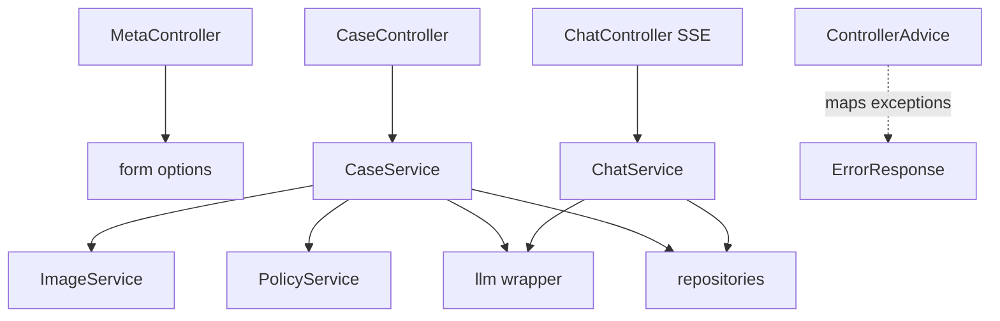
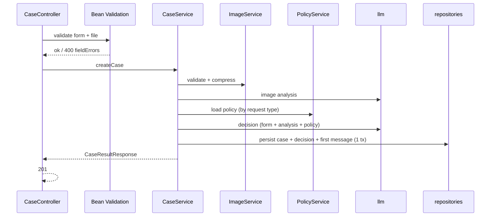

# ADR-001: Backend API & Orchestration

**Date:** 2026-06-24
**Status:** Accepted
**Relates to:** [`000-main-architecture.md`](000-main-architecture.md)

---

## 1. Scope

Covers the Spring Boot backend: REST + SSE endpoints, request/response DTOs, validation, the service orchestration layer, image handling boundary, policy loading, error handling, and configuration. Does NOT cover the LLM call internals (see [`002-llm-integration.md`](002-llm-integration.md)) or persistence detail (see [`004-database.md`](004-database.md)).

---

## 2. Context7 References

| Library | Context7 Handle | Used for |
|---|---|---|
| Spring Boot | `/spring-projects/spring-boot` | Web MVC, multipart, validation, `SseEmitter`, Data JPA, config properties |

Plain Maven deps: `net.coobird:thumbnailator` (image compression), `org.xerial:sqlite-jdbc`, `org.hibernate.orm:hibernate-community-dialects`.

---

## 3. Component Design

Spring Web MVC (servlet stack), base package `pl.nbp.copilot`.

- **web** — `MetaController`, `CaseController`, `ChatController`; DTOs; `@ControllerAdvice` global exception handler mapping exceptions to the common error body.
- **service**
  - `CaseService` — orchestrates submission: validate → compress → image analysis → persist case → decision → persist decision + first message → assemble response.
  - `ChatService` — builds full message history from the DB, runs the streaming LLM call, writes deltas to the `SseEmitter`, persists the assistant message on completion.
  - `PolicyService` — loads the correct policy Markdown (complaint/return) once and caches it.
  - `MessageFormatter` — renders the structured decision into the Polish first-message Markdown (greeting → decision → justification → next steps → disclaimer).
- **image** — `ImageService`: MIME/size validation and Thumbnailator compression; returns bytes + metadata + base64.
- **config** — LLM client bean, CORS, multipart size limits, typed `CopilotProperties`.

SSE uses `SseEmitter`: the streaming LLM call runs on a worker thread (bounded executor) that writes `delta` events and completes/errors the emitter. The initial submission is fully synchronous.

---

## 4. Data Structures

Request/response DTOs (conceptual; validation in parentheses):

- **CaseSubmissionForm** (multipart parts): `requestType` (required, enum), `equipmentCategory` (required, enum), `equipmentName` (required, non-blank), `purchaseDate` (required, ISO date, not future), `reason` (required iff `requestType=REKLAMACJA`), `image` (required file).
- **CaseResultResponse**: `caseId`, `decision { outcome, justificationMarkdown, nextStepsMarkdown, confidence }` (decision may be a review/needs-better-photo state), `firstMessage { role, contentMarkdown }`, `imageAnalysis { summary, lowConfidence, confidence }`, `disclaimer`.
- **ChatMessageRequest**: `content` (required, non-blank, max length).
- **CaseDetailResponse**: case summary + decision + ordered `messages[]`.
- **FormOptionsResponse**: `requestTypes[] { value, label }`, `equipmentCategories[] { value, label }` (Polish labels).
- **ErrorResponse**: `code`, `message` (Polish), `fieldErrors[]?`, `retryable?`.

---

## 5. Interface Contracts

### GET `/api/meta/form-options`
- **Input:** none.
- **Output:** 200 `FormOptionsResponse`.
- **Errors:** none expected.
- **Notes:** Lets the frontend render selectors from one authoritative source.

### POST `/api/cases`  (`multipart/form-data`)
- **Input:** `CaseSubmissionForm` parts.
- **Output:** 201 `CaseResultResponse`.
- **Errors:**
  - 400 — field validation failure (missing reason for complaint, future date, missing image) → `fieldErrors`.
  - 400 — file too large (> `COPILOT_IMAGE_MAX_BYTES`), message states the 10 MB limit.
  - 415 — unsupported image type (only JPEG/PNG/WebP).
  - 503 — LLM unavailable after retries (`retryable: true`); nothing persisted.
- **Notes:** Synchronous (runs both LLM stages). A low-confidence/unusable image returns **201** with `imageAnalysis.lowConfidence=true` and a first message asking for a better photo — never a fabricated verdict.

### POST `/api/cases/{caseId}/messages`  → SSE
- **Input:** `ChatMessageRequest`.
- **Output:** `text/event-stream`; events: `delta` (data: token chunk), terminal `done` (data: `{ messageId }`), `error` (data: `{ message, retryable }`).
- **Errors:** 404 (unknown case), 400 (empty content), 503 (LLM unavailable — emitted as `error` event if the stream had already opened).
- **Notes:** Full case context (form + image analysis + first decision + prior turns) is rebuilt from the DB each call; the OpenRouter Responses-style statelessness is irrelevant because we use Chat Completions with explicit history.

### GET `/api/cases/{caseId}`
- **Input:** none.
- **Output:** 200 `CaseDetailResponse`.
- **Errors:** 404 (unknown case).
- **Notes:** Supports chat-screen refresh / deep-linking.

---

## 6. Technical Decisions

### Spring Web MVC + `SseEmitter` (not WebFlux)
**Status:** Accepted · **Date:** 2026-06-24
**Context:** We need SSE streaming but the rest of the app is simple blocking I/O with JPA.
**Decision:** Use servlet-stack MVC with `SseEmitter`; run the streaming LLM call on a bounded worker executor.
**Rejected alternatives:** WebFlux — reactive complexity unjustified; JPA is blocking anyway.
**Consequences:** (+) Simple, familiar, integrates with JPA. (−) One thread per active stream; fine at PoC scale.
**Review trigger:** If concurrent chat streams exceed the thread budget.

### `/api/meta/form-options` as the single source of selector values
**Status:** Accepted · **Date:** 2026-06-24
**Context:** Request types and equipment categories must match between the form, validation, and prompts.
**Decision:** Serve the enums + Polish labels from the backend; the frontend renders from this.
**Rejected alternatives:** Hardcode lists in the frontend — risks drift from backend enums/prompts.
**Consequences:** (+) One source of truth. (−) One extra call on form load (cacheable).
**Review trigger:** n/a for PoC.

### Server-side validation authoritative; client mirrors it
**Status:** Accepted · **Date:** 2026-06-24
**Context:** AC requires inline client errors and safe server behavior.
**Decision:** Bean Validation on DTOs is authoritative; the frontend mirrors rules for UX but the server re-checks everything (type, size, conditional reason, non-future date).
**Consequences:** (+) Secure and consistent. (−) Rules expressed in two places; kept in sync via the meta endpoint and shared constants.
**Review trigger:** n/a.

---

## 7. Diagrams

### Component / flow

### Submission orchestration

---

## 8. Testing Strategy

### Test scenarios for this area

| Scenario | Type | Input | Expected output | Edge cases |
|---|---|---|---|---|
| Valid complaint submission | Integration | Multipart with reason + photo; LLM mocked | 201 with decision + first message; rows persisted | Borderline → WYMAGA_WERYFIKACJI |
| Valid return submission | Integration | Multipart, no reason; LLM mocked | 201 | Used item → NIE_KWALIFIKUJE_SIE |
| Missing reason for complaint | Unit/Integration | REKLAMACJA, blank reason | 400 fieldError on `reason` | — |
| Future purchase date | Unit/Integration | date > today | 400 fieldError | exactly today allowed |
| Oversized / wrong-type file | Integration | 12 MB / .gif | 400 (size) / 415 (type) before LLM | exactly 10 MB allowed |
| LLM failure on submit | Integration | mock LLM returns 5xx | 503 retryable, no rows persisted | retries exhausted |
| Chat SSE stream | Integration | valid case + message; mock streaming LLM | `delta`+ then `done` with messageId; assistant persisted | unknown case → 404 |
| Refresh resume | Integration | GET existing case | full ordered history | unknown id → 404 |

### Technical acceptance criteria
- **TAC-001-01** Validation rejects invalid submissions before any LLM/image work and returns field-level Polish errors.
- **TAC-001-02** A successful submission returns 201 and persists the full case graph in one transaction.
- **TAC-001-03** An unusable image yields 201 + `lowConfidence=true` + a "better photo" first message, never a verdict.
- **TAC-001-04** LLM failure on submit yields 503 `retryable:true` and zero persisted decision/message rows.
- **TAC-001-05** The chat endpoint returns `text/event-stream`, emits ordered `delta` events, and a terminal `done` with the persisted message id.
- **TAC-001-06** `GET /api/cases/{id}` returns the complete ordered message history for a known case and 404 otherwise.
- **TAC-001-07** All error responses use the common `ErrorResponse` shape with Polish messages.
