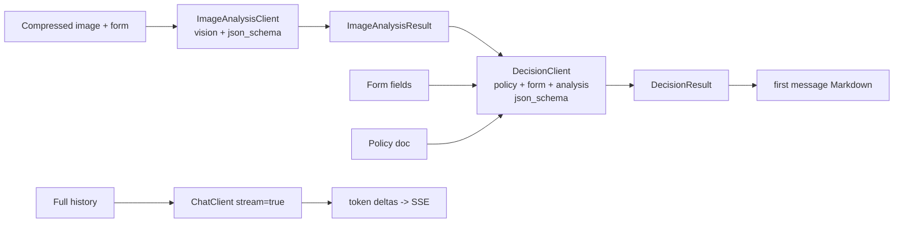
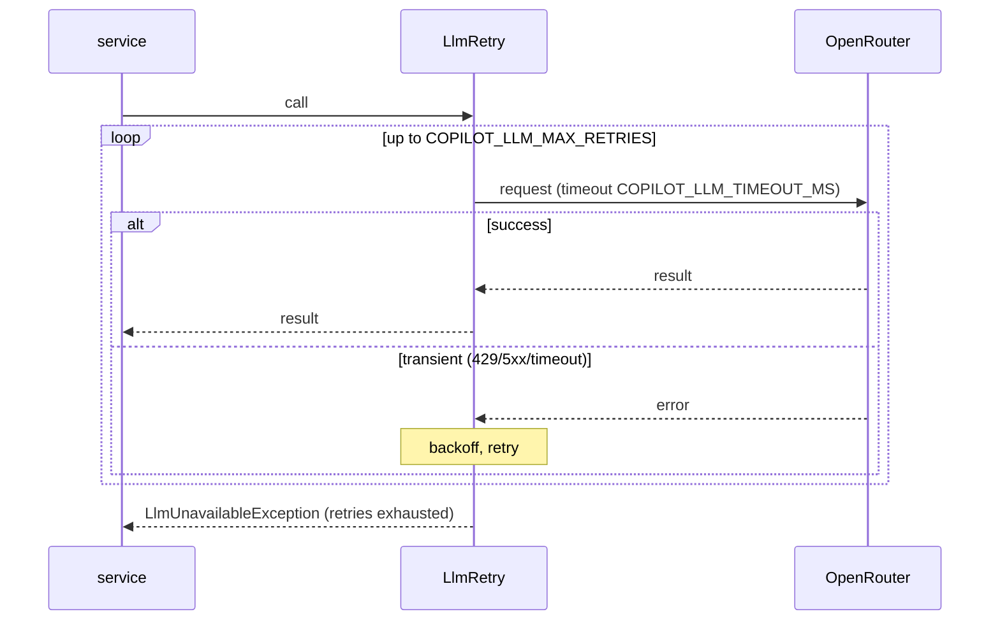

# ADR-002: LLM Integration (OpenRouter via openai-java)

**Date:** 2026-06-24
**Status:** Accepted
**Relates to:** [`000-main-architecture.md`](000-main-architecture.md)

---

## 1. Scope

Covers how the backend calls the LLM: the `openai-java` client configuration against OpenRouter, the choice of Chat Completions API, the two-stage pipeline (multimodal image analysis → reasoning decision), streaming chat, structured outputs, prompt assembly, policy injection, retries/timeouts, and image-as-input handling. Does NOT cover HTTP endpoints (see [`001-backend-api.md`](001-backend-api.md)) or persistence (see [`004-database.md`](004-database.md)).

---

## 2. Context7 References

| Library | Context7 Handle | Used for |
|---|---|---|
| OpenAI Java SDK | `/openai/openai-java` | Client config, Chat Completions, vision input, streaming, structured output |

Key SDK facts (verified): `com.openai:openai-java` (~4.41.x); base URL override via `.baseUrl()` / `OPENAI_BASE_URL`; vision via image content parts (base64 data URI); streaming via `createStreaming()` with accumulator helpers; structured output via `responseFormat(Class<T>)` deriving a JSON schema from a Java class (Chat Completions). Sync and async clients available.

---

## 3. Component Design

`llm` package:
- **LlmClientConfig** (in `config`) — builds the `OpenAIClient` bean: API key (`OPENAI_API_KEY` else `OPENROUTER_API_KEY`), base URL (`OPENROUTER_BASE_URL`), timeout, OpenRouter attribution headers if needed.
- **ImageAnalysisClient** — runs the multimodal Chat Completions call; input = analysis system prompt (complaint or return variant) + user message with declared category/model text and the base64 image part; requests structured `ImageAnalysisResult`.
- **DecisionClient** — runs the reasoning Chat Completions call; input = system prompt (policy doc + decision rules + output contract) + user message (form fields + image-analysis JSON); requests structured `DecisionResult`.
- **ChatClient** — runs the streaming Chat Completions call with the full message history; emits token deltas to the caller (consumed by `ChatService` → SSE).
- **PromptLibrary** — holds the four prompt templates (complaint-analysis, return-analysis, complaint-decision, return-decision) and the chat system preamble; all enforce Polish output, tone, the fixed outcome categories, and the mandatory disclaimer.
- **LlmRetry** — wraps calls with bounded retry/backoff on transient errors (429/5xx/timeout) and maps terminal failure to `LlmUnavailableException`.

### Structured output result shapes (conceptual)
- **ImageAnalysisResult**: `equipmentMatchesCategory` (bool), `analyzable` (bool), `damageOrUsePresent` (bool), `observations` (text), `damageTypeOrCondition` (text), `probableCause` (text, complaints), `resaleableAsNew` (bool, returns), `confidence` (LOW|MEDIUM|HIGH).
- **DecisionResult**: `outcome` (KWALIFIKUJE_SIE|NIE_KWALIFIKUJE_SIE|WYMAGA_WERYFIKACJI), `justification` (text), `nextSteps` (text), `confidence` (LOW|MEDIUM|HIGH), `needsBetterPhoto` (bool), `missingInfo` (text, optional).

---

## 4. Data Structures

- **Outbound (analysis):** chat messages `[system: analysis prompt; user: text + image_url(base64 data URI)]`, `response_format = json_schema(ImageAnalysisResult)`, model = `COPILOT_VISION_MODEL`.
- **Outbound (decision):** `[system: policy + rules + contract; user: form JSON + analysis JSON]`, `response_format = json_schema(DecisionResult)`, model = `COPILOT_DECISION_MODEL`.
- **Outbound (chat):** `[system: chat preamble + case context; ...history...; user: new message]`, `stream = true`, model = `COPILOT_DECISION_MODEL`.
- **Inbound:** validated JSON mapped to the result classes; on schema rejection, fall back to `json_object` + parse + bean validation + one repair retry.

---

## 5. Interface Contracts

Methods exposed to `service`:
- `analyzeImage(requestType, category, model, imageBytes) → ImageAnalysisResult` (throws `LlmUnavailableException`).
- `decide(requestType, form, analysis, policyText) → DecisionResult` (throws `LlmUnavailableException`).
- `streamChat(history, onDelta, onComplete, onError)` — pushes deltas; completes or errors.

All methods enforce the configured timeout and retry policy. None persist; persistence is the caller's responsibility.

---

## 6. Technical Decisions

### Use OpenRouter Chat Completions API (not the Responses API)
**Status:** Accepted · **Date:** 2026-06-24
**Context:** The product needs vision input, structured outputs, and streaming. OpenRouter exposes both a Chat Completions API and a beta Responses API; `openai-java` supports both.
**Decision:** Call OpenRouter's Chat Completions API. It is mature, fully OpenAI-compatible, and has confirmed support for base64 vision input, `response_format` JSON-schema structured output (including with streaming), and token streaming. We supply full conversation history explicitly.
**Rejected alternatives:**
- OpenRouter Responses API: documented as **beta** ("may have breaking changes," unsuitable for stable production), stateless, and its docs do not confirm vision/structured-output/streaming — exactly our required features.
- "Responses first, Completions fallback": doubles the integration surface for no MVP benefit.
**Consequences:** (+) Stable, well-documented, feature-complete for our needs. (−) We manage conversation history ourselves (already required for DB persistence/resume).
**Review trigger:** If OpenRouter's Responses API leaves beta with confirmed vision/structured/streaming support and offers a clear advantage.

### Both stages on `openai/gpt-5.4-mini`, per-stage configurable
**Status:** Accepted · **Date:** 2026-06-24
**Context:** Need a vision-capable model for analysis and a reasoning-capable model for decisions, at PoC cost.
**Decision:** Default both `COPILOT_VISION_MODEL` and `COPILOT_DECISION_MODEL` to `openai/gpt-5.4-mini`; expose each as an env var so a stronger decision model can be swapped in without code changes.
**Rejected alternatives:** Hardcoding a single model (no tuning room); defaulting to the full model (higher cost, overkill for PoC).
**Consequences:** (+) Cheap, tunable. (−) Mini model may be weaker on borderline decisions — mitigated by routing low-confidence to `WYMAGA_WERYFIKACJI`.
**Review trigger:** If decision quality on borderline cases is insufficient, raise `COPILOT_DECISION_MODEL`.

### Compress images before sending; cap the longest edge
**Status:** Accepted · **Date:** 2026-06-24
**Context:** Up to 10 MB uploads would waste tokens/latency and may exceed model limits.
**Decision:** Resize the longest edge to `COPILOT_IMAGE_TARGET_EDGE` (default 1568 px) and re-encode (JPEG ~0.8) before base64, in `ImageService`.
**Rejected alternatives:** Send the original — slow and token-heavy.
**Consequences:** (+) Lower latency/cost. (−) Extreme detail loss possible; acceptable for condition assessment, and the agent flags low confidence when unsure.
**Review trigger:** If compression artifacts degrade analysis accuracy.

### Policy documents injected per request type
**Status:** Accepted · **Date:** 2026-06-24
**Context:** Decisions must follow the complaint vs return rules; the PRD ships seed policy docs.
**Decision:** `PolicyService` loads `docs/policies/complaint-policy.md` for REKLAMACJA and `return-policy.md` for ZWROT and injects the text into the decision system prompt. This injection point is the future seam for a RAG knowledge base (backlog).
**Consequences:** (+) Decisions grounded in editable docs; backlog-ready. (−) Large policies consume prompt tokens; fine at current size.
**Review trigger:** If policies grow enough to need retrieval instead of full injection.

---

## 7. Diagrams

### Two-stage pipeline

### Retry / failure handling

---

## 8. Testing Strategy

### Test scenarios for this area

| Scenario | Type | Input | Expected output | Edge cases |
|---|---|---|---|---|
| Analysis prompt selection | Unit | requestType REKLAMACJA vs ZWROT | Correct analysis prompt variant used | category mismatch flagged |
| Decision prompt + policy injection | Unit | form + analysis + policy text | Decision prompt contains policy + form + analysis | missing reason (return) handled |
| Structured output mapping | Unit | mock JSON response | Mapped to result class; enum outcome valid | invalid enum → repair retry path |
| Structured-output fallback | Unit | model rejects json_schema | Falls back to json_object + validate + 1 repair | repair also fails → error |
| Retry then success | Unit/Integration | mock 503 then 200 | Returns result after retry | — |
| Retries exhausted | Unit/Integration | mock always 503 | `LlmUnavailableException` | no partial result |
| Streaming deltas | Integration | mock streaming response | Ordered deltas + completion; history rebuilt | mid-stream error → onError |
| Image base64 input | Unit | compressed bytes | Image part is a valid base64 data URI with correct MIME | webp supported |

### Technical acceptance criteria
- **TAC-002-01** The image-analysis call uses the complaint/return prompt matching `requestType` and includes the base64 image as a vision part.
- **TAC-002-02** The decision call includes the correct policy document text, the form fields, and the analysis result.
- **TAC-002-03** `DecisionResult.outcome` is always one of the three enum values; non-conforming output triggers the repair/fallback path, not a persisted bad value.
- **TAC-002-04** Transient errors are retried up to `COPILOT_LLM_MAX_RETRIES`; exhausted retries raise `LlmUnavailableException` with no partial result.
- **TAC-002-05** The client targets `OPENROUTER_BASE_URL` with the resolved key; no call goes to api.openai.com unless explicitly configured.
- **TAC-002-06** Streaming chat emits tokens incrementally and signals completion distinctly from error.
- **TAC-002-07** All prompts instruct Polish-only output, the mandatory disclaimer, and routing of low-confidence cases to `WYMAGA_WERYFIKACJI`.
