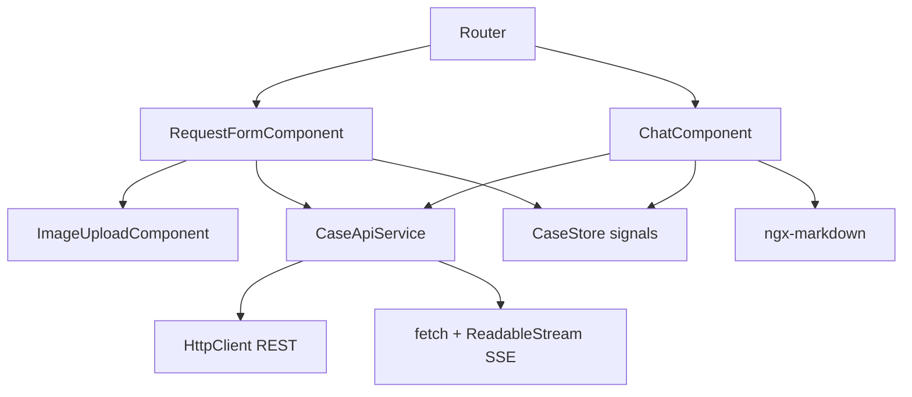
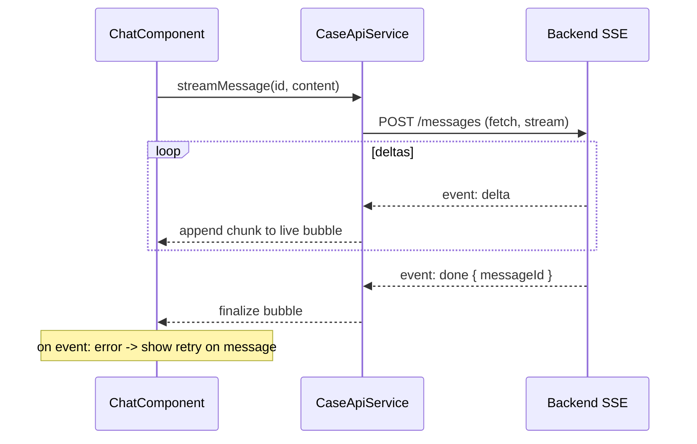

# ADR-003: Frontend (Angular + Angular Material)

**Date:** 2026-06-24
**Status:** Accepted
**Relates to:** [`000-main-architecture.md`](000-main-architecture.md)

---

## 1. Scope

Covers the Angular SPA: project setup, routing, the two screens (request form, chat), component/service structure, state, REST calls, SSE consumption for streaming chat, Markdown rendering, image upload + client validation, Polish localization, and dev proxy. Does NOT cover backend endpoints (see [`001-backend-api.md`](001-backend-api.md)).

---

## 2. Context7 References

| Library | Context7 Handle | Used for |
|---|---|---|
| Angular | `/websites/angular_dev` | Standalone components, signals, reactive forms, HttpClient, router |
| Angular Material | `/websites/material_angular_dev` | Form fields, select, datepicker, inputs, buttons, cards, list, toolbar, progress, snackbar |

Plain npm deps (resolve handles when first used): `ngx-markdown` (render agent Markdown). Confirm the Angular 20 default unit-test runner (Karma/Jasmine vs experimental Vitest) via Context7 before scaffolding tests.

---

## 3. Component Design

Angular 20 workspace at `app/frontend`, standalone components + signals, strict TypeScript.

- **Routing:** `/` → `RequestFormComponent`; `/chat/:caseId` → `ChatComponent`. Deep-linking/refresh on `/chat/:caseId` rehydrates via `GET /api/cases/{id}`.
- **RequestFormComponent** — reactive form using Material controls: request-type select, equipment-category select (from `/api/meta/form-options`), model text input, datepicker (max = today), reason textarea (validators toggle required/optional on request-type change), image upload control. Shows inline Polish errors, a locked processing state on submit, and an error banner with retry that preserves entered values + the selected image. On success, navigates to `/chat/:caseId`.
- **ImageUploadComponent** — single-file picker with object-URL preview and remove/replace; client-side type (JPEG/PNG/WebP) and size (≤10 MB) checks mirroring the backend.
- **ChatComponent** — message list (Material list/cards) rendering Markdown via `ngx-markdown`; the first ASSISTANT message shows the highlighted outcome, justification, next steps, disclaimer; input + send; agent "typing" indicator while streaming; per-message error + retry; optional collapsible case-context summary header.
- **CaseApiService** — `getFormOptions()`, `submitCase(formData)` (multipart), `getCase(id)`, `streamMessage(id, content)` (SSE via fetch + `ReadableStream`).
- **CaseStore** — signal-based store holding current case, decision, and messages; exposes derived signals for the chat view.
- **Localization:** all strings Polish, kept as constants/Material i18n date formats set to `pl-PL`; no multi-locale framework (single locale per PRD).

---

## 4. Data Structures

Frontend models mirror the backend DTOs (see [`001-backend-api.md`](001-backend-api.md) §4): `FormOptions`, `CaseSubmission` (assembled into `FormData`), `CaseResult` (decision + firstMessage + imageAnalysis summary), `CaseDetail` (history), `ChatMessageVM { role, markdown, pending?, error? }`. SSE chunks are accumulated into the current assistant `ChatMessageVM.markdown` as they arrive.

---

## 5. Interface Contracts

- **Form submit:** `POST /api/cases` as `multipart/form-data`; on 400 map `fieldErrors` to inline messages; on 415/oversize show the upload error; on 503 show the retry banner (values preserved).
- **Chat send:** `POST /api/cases/{id}/messages` consumed as SSE. Because the browser `EventSource` only supports GET, the SSE stream is consumed with `fetch` (POST) + a `ReadableStream` reader that parses `delta`/`done`/`error` events; deltas append to the live assistant bubble, `done` finalizes it, `error` shows a retry on that message.
- **Resume:** `GET /api/cases/{id}` populates `CaseStore` on direct navigation to `/chat/:caseId`.

---

## 6. Technical Decisions

### Custom chat UI on Angular Material + `ngx-markdown`
**Status:** Accepted · **Date:** 2026-06-24
**Context:** No strong drop-in Angular Material chat component exists; the agent output is formatted Markdown in Polish.
**Decision:** Build a lightweight chat from Material primitives and render agent text with `ngx-markdown`.
**Rejected alternatives:** GetStream `stream-chat-angular` (tied to their hosted backend — wrong fit for our own backend); Syncfusion Chat UI (commercial license).
**Consequences:** (+) Full control, no vendor lock-in, fits our SSE backend. (−) We implement chat affordances ourselves (manageable for MVP scope).
**Review trigger:** If chat requirements grow (attachments, reactions, multi-thread) beyond what a custom component should carry.

### Consume SSE with `fetch` + `ReadableStream`, not `EventSource`
**Status:** Accepted · **Date:** 2026-06-24
**Context:** The chat endpoint is POST (carries a JSON body); `EventSource` only issues GET requests.
**Decision:** Use `fetch` with a streamed `ReadableStream` reader to parse the `text/event-stream` response.
**Rejected alternatives:** Make the chat endpoint GET with query params (awkward for message bodies); WebSockets (heavier than needed).
**Consequences:** (+) Keeps a clean POST contract; supported in modern browsers (responsive-web target). (−) Manual SSE parsing on the client (small, well-understood).
**Review trigger:** If we must support browsers without `fetch` streaming.

### Dev proxy instead of permissive CORS
**Status:** Accepted · **Date:** 2026-06-24
**Context:** Two-process local dev (Angular dev server + Spring Boot).
**Decision:** Angular dev server proxies `/api/**` to the backend; backend CORS allows only `COPILOT_CORS_ALLOWED_ORIGINS`.
**Rejected alternatives:** Wildcard CORS — looser than necessary even for a PoC.
**Consequences:** (+) Same-origin in dev; tight CORS. (−) Proxy config to maintain.
**Review trigger:** Change of deployment topology.

---

## 7. Diagrams

### Component / service structure

### Streaming chat on the client

---

## 8. Testing Strategy

### Test scenarios for this area

| Scenario | Type | Input | Expected output | Edge cases |
|---|---|---|---|---|
| Conditional reason validator | Unit | toggle request type | reason required for REKLAMACJA, optional for ZWROT | switching types updates validity |
| Future date blocked | Unit | date > today | control invalid, inline error | today allowed |
| Image client validation | Unit | wrong type / >10 MB | inline upload error, no submit | exactly 10 MB allowed |
| Submit success → navigate | Component | mocked 201 | navigates to `/chat/:caseId`, store populated | — |
| Submit 503 → retry preserves data | Component | mocked 503 | error banner; form values + image retained | retry re-submits |
| SSE accumulation | Unit | mocked delta stream | bubble text grows; finalizes on done | error event shows retry |
| Resume on refresh | Component | mocked GET case | chat rehydrated from history | unknown id → error state |
| First message rendering | Component | decision result | Markdown rendered with outcome, justification, next steps, disclaimer | — |

### Technical acceptance criteria
- **TAC-003-01** The reason field is required only for REKLAMACJA and updates reactively when the request type changes.
- **TAC-003-02** Client-side image validation blocks non-JPEG/PNG/WebP and >10 MB files before submission.
- **TAC-003-03** A failed submission (503) shows a Polish retry banner and preserves all entered values and the selected image.
- **TAC-003-04** Streaming chat appends deltas to a single assistant bubble and finalizes on `done`; an `error` event surfaces a per-message retry.
- **TAC-003-05** Navigating directly to `/chat/:caseId` rehydrates the conversation via `GET /api/cases/{id}`.
- **TAC-003-06** Agent messages render Markdown; all static UI strings are Polish.
- **TAC-003-07** No call hits the backend cross-origin in dev (the proxy serves `/api`).
