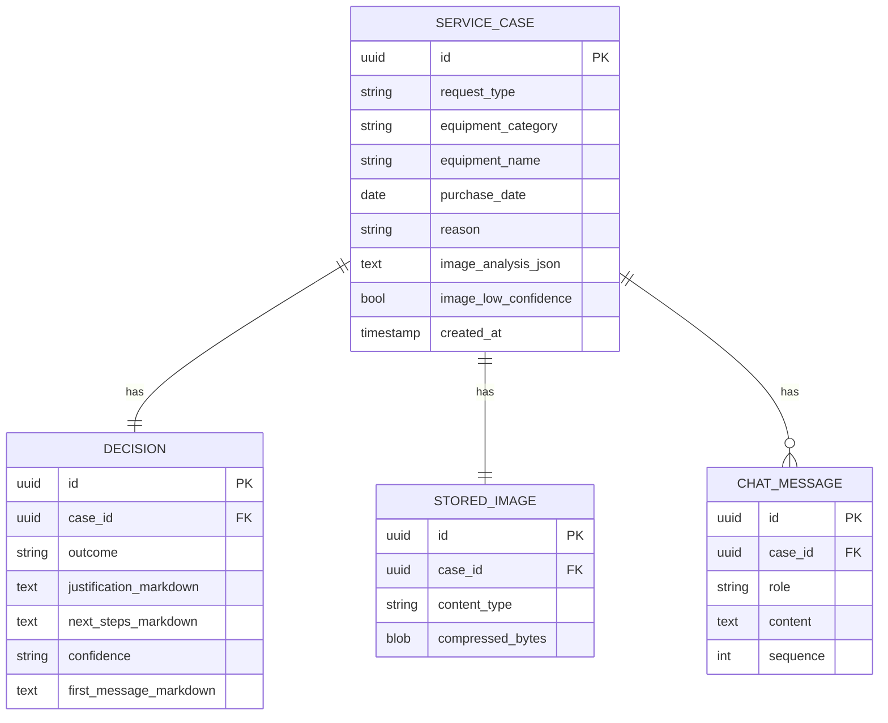
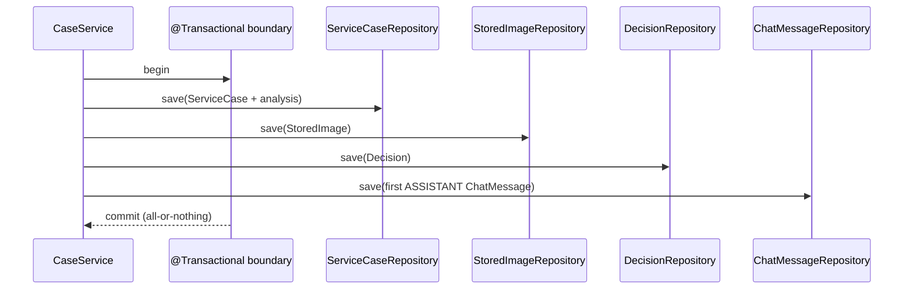

# ADR-004: Database & Persistence

**Date:** 2026-06-24
**Status:** Accepted
**Relates to:** [`000-main-architecture.md`](000-main-architecture.md)

---

## 1. Scope

Covers the persistence layer: SQLite engine, JPA/Hibernate configuration, the conceptual schema, entity relationships, and repository contracts. Does NOT cover business orchestration (see [`001-backend-api.md`](001-backend-api.md)) or LLM payloads (see [`002-llm-integration.md`](002-llm-integration.md)).

---

## 2. Context7 References

| Library | Context7 Handle | Used for |
|---|---|---|
| Spring Boot | `/spring-projects/spring-boot` | Spring Data JPA auto-config, transactions |
| Spring Boot JPA samples | `/andreipall/spring-boot-jpa` | JPA performance/mapping patterns |

Plain Maven deps (no pinned handle yet): `org.xerial:sqlite-jdbc`, `org.hibernate.orm:hibernate-community-dialects` (SQLite dialect).

---

## 3. Component Design

- **Engine:** SQLite, single file at `COPILOT_DB_PATH` (default `./data/copilot.db`), created on first run; the `data/` directory is gitignored.
- **ORM:** Spring Data JPA over Hibernate with the community SQLite dialect. Schema managed by Hibernate `ddl-auto=update` for the PoC (review before any production use; a migration tool such as Flyway is the upgrade path).
- **Transactions:** Case creation persists ServiceCase, StoredImage, Decision, and the first ChatMessage within one transaction so a partial failure leaves no orphan rows. A failed LLM call aborts the transaction before any Decision/ASSISTANT message is written.
- **Concurrency:** SQLite is single-writer. Keep transactions short; rely on low PoC load. WAL mode may be enabled to improve read/write concurrency.
- **IDs:** Application-generated UUID strings (assigned before insert), so the API can return `caseId` without a DB round-trip dependency on auto-increment.

---

## 4. Data Structures

Conceptual tables (types are logical, not DDL):

**service_case**
| Field | Type | Notes |
|---|---|---|
| id | UUID (PK) | |
| request_type | enum text | REKLAMACJA \| ZWROT |
| equipment_category | enum text | from the fixed category set |
| equipment_name | text | user-entered model |
| purchase_date | date | not in the future |
| reason | text, nullable | required for complaints, optional for returns |
| image_analysis_json | text | raw structured analysis result |
| image_low_confidence | boolean | true when the photo was not reliably analyzable |
| created_at | timestamp | |

**stored_image** (one current image per case)
| Field | Type | Notes |
|---|---|---|
| id | UUID (PK) | |
| case_id | UUID (FK → service_case) | |
| content_type | text | image/jpeg \| image/png \| image/webp |
| original_size_bytes | integer | |
| compressed_size_bytes | integer | |
| width / height | integer | post-compression dimensions |
| compressed_bytes | blob | compressed image |
| created_at | timestamp | |

**decision** (one per case)
| Field | Type | Notes |
|---|---|---|
| id | UUID (PK) | |
| case_id | UUID (FK) | |
| outcome | enum text | KWALIFIKUJE_SIE \| NIE_KWALIFIKUJE_SIE \| WYMAGA_WERYFIKACJI |
| justification_markdown | text | |
| next_steps_markdown | text | |
| confidence | enum text | LOW \| MEDIUM \| HIGH |
| first_message_markdown | text | the rendered first chat bubble |
| created_at | timestamp | |

**chat_message**
| Field | Type | Notes |
|---|---|---|
| id | UUID (PK) | |
| case_id | UUID (FK) | |
| role | enum text | SYSTEM \| ASSISTANT \| USER |
| content | text | |
| sequence | integer | monotonic per case, for ordering |
| created_at | timestamp | |

Relationships: `service_case` 1—1 `decision`, 1—1 `stored_image` (current), 1—N `chat_message`. All children cascade-delete with the case.

---

## 5. Interface Contracts

Repositories (Spring Data JPA) consumed by `service`:
- **ServiceCaseRepository** — save; find by id (with decision + messages for resume).
- **StoredImageRepository** — save; find current image by case id.
- **DecisionRepository** — save; find by case id.
- **ChatMessageRepository** — save; find by case id ordered by `sequence`; next sequence for a case.

No repository is exposed directly to the web layer; controllers go through services.

---

## 6. Technical Decisions

### SQLite with Hibernate community dialect
**Status:** Accepted · **Date:** 2026-06-24
**Context:** Need durable single-file persistence locally with JPA, per the main-architecture decision to add SQLite now.
**Decision:** Use `sqlite-jdbc` + `hibernate-community-dialects` SQLite dialect; `ddl-auto=update` for the PoC.
**Rejected alternatives:** H2 (less representative of a real file DB the team wanted); Postgres (ops overhead for a local PoC).
**Consequences:** (+) Zero-server, single file, easy to inspect/reset. (−) Single-writer concurrency; `ddl-auto=update` is not safe for production schema evolution.
**Review trigger:** Concurrency contention, or any move beyond local PoC (introduce Flyway + networked DB).

### Store the compressed image as a BLOB
**Status:** Accepted · **Date:** 2026-06-24
**Context:** The chat may reference the photo and the case should be self-contained for resume; images are small after compression.
**Decision:** Persist compressed image bytes in `stored_image.compressed_bytes`; do not keep the original at full size.
**Rejected alternatives:** Filesystem path references (extra moving parts for a PoC); not storing the image (breaks resume and any future re-analysis).
**Consequences:** (+) Self-contained DB, simple backup/reset. (−) DB grows with images; acceptable at PoC scale.
**Review trigger:** If DB size or row sizes become a problem, move blobs to object storage.

---

## 7. Diagrams

### Persistence sequence (case creation, single transaction)

---

## 8. Testing Strategy

### Test scenarios for this area

| Scenario | Type | Input | Expected output | Edge cases |
|---|---|---|---|---|
| Save + reload case | Integration | A full case graph | Same fields back, messages ordered by sequence | UTF-8 Polish text round-trips intact |
| Transaction rollback | Integration | Decision save throws | No ServiceCase/StoredImage rows persisted | Partial failure leaves no orphans |
| Cascade delete | Integration | Delete a case | Decision, image, messages all removed | — |
| Sequence ordering | Unit/Integration | Several messages | `findByCaseId` returns ascending `sequence` | Concurrent appends get distinct sequences |
| Blob round-trip | Integration | Compressed image bytes | Bytes returned identical | Large-but-valid image within limits |

### Technical acceptance criteria
- **TAC-004-01** A committed case has exactly one ServiceCase, one StoredImage, one Decision, and ≥1 ChatMessage.
- **TAC-004-02** A failure after ServiceCase save but before commit persists zero rows for that case.
- **TAC-004-03** `findByCaseIdOrderBySequence` returns messages in strictly ascending order.
- **TAC-004-04** Polish characters in persisted text are byte-for-byte preserved on reload.
- **TAC-004-05** Integration tests use an isolated temp SQLite file (or unique path) and do not touch the dev database.
