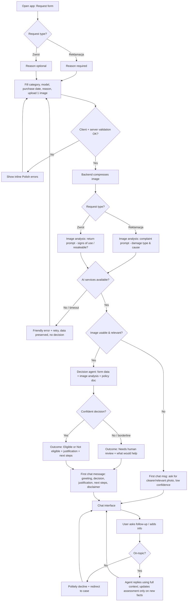

# PRD — Hardware Service Decision Copilot

> Status: MVP / PoC
> Audience: developer and AI agents producing the ADR and the implementation.
> All user-facing text in the product is in **Polish**. This document is in English.

---

## 1. Executive Summary

Hardware Service Decision Copilot is a self-service web application (MVP/PoC) that lets a customer submit a hardware **complaint** (reklamacja) or **return** (zwrot / odstąpienie od umowy) request, attach a single photo of the equipment, and receive an **advisory decision with a clear justification** generated by an AI agent. The customer first fills a short structured form, then continues the case in a chat interface where the agent answers follow-up questions using the full case context. The decision is **advisory only** — it guides the customer and is explicitly stated to be non-binding, with low-confidence cases flagged for human review.

---

## 2. Problem Statement

When a customer wants to complain about or return a piece of electronics, they cannot easily tell whether their case qualifies. Eligibility depends on the request type (complaint vs. return), the time since purchase, the visible condition of the item, and company/legal policy (in Poland: the 14-day distance-sale withdrawal right and the 2-year liability for non-conformity / rękojmia). Today the customer either reads dense legal terms themselves, opens a ticket and waits, or calls support — all slow, inconsistent, and frequently producing requests that are rejected later because the basic conditions were never met. There is no fast, transparent way for the customer to understand the likely outcome and what to do next before submitting a formal request.

---

## 3. Users / Personas

### Persona A — Anna, the everyday consumer
Bought a laptop online 9 months ago; the screen now flickers. She is not technical and does not know the difference between rękojmia and gwarancja. She wants to know **whether her complaint has a chance**, what evidence matters, and what to do next. She expects a plain-Polish answer, not a legal wall of text.

### Persona B — Marek, the "changed my mind" returner
Bought wireless headphones 5 days ago, never really used them, wants his money back. He wants to confirm he is **within the withdrawal window** and that the unopened/unused condition qualifies for a full refund, and to learn how to ship them back.

### Persona C — Katarzyna, the borderline case
Dropped her phone; the screen is cracked. She wants to file a complaint but is unsure whether accidental damage is covered. She expects the system to be **honest** when her case is weak or ambiguous, and to tell her where a human can take over rather than giving false hope.

---

## 4. Main Flows

### 4.1 Happy path — Complaint (reklamacja)
1. User opens the app and lands on the **request form**.
2. User selects request type **Reklamacja**.
3. User selects equipment category, types the model name, picks the purchase date, and writes the reason (mandatory for complaints).
4. User uploads one photo of the equipment showing its condition (e.g. the visible damage).
5. User submits. The system validates all fields client- and server-side.
6. The backend compresses the image and runs the **image-analysis step** using the *complaint* analysis prompt: it judges whether and how the item is damaged and what could have caused it.
7. The **decision agent** combines the image analysis, the form data, and the **complaint policy document** to produce an advisory decision (e.g. *likely eligible / likely not eligible / needs human review*) with a justification and next steps.
8. The user is taken to the **chat interface**. The first system message (first chat bubble) contains a greeting, the decision, the justification, the next steps, and the non-binding disclaimer — nicely formatted.
9. The user can ask follow-up questions; the agent answers using the full case context.

### 4.2 Happy path — Return (zwrot / odstąpienie od umowy)
1. Same form, request type **Zwrot**.
2. Reason field is **optional** for returns.
3. The image-analysis step uses the *return* analysis prompt: it judges whether the item shows **no signs of use** and could be resold as new (resaleable condition).
4. The decision agent uses the **return policy document** to judge eligibility (within withdrawal window + acceptable condition) and produces the advisory decision, justification, and next steps.
5. Chat interface opens with the first system message, as above.

### 4.3 Alternative — Unusable or mismatched image
1. The image-analysis step cannot reliably assess the item (blurry, dark, irrelevant, or the item does not match the declared category).
2. The agent does **not** force a verdict. The first chat message asks the user to upload a clearer/relevant photo and explains what the photo must show. Confidence is marked low.

### 4.4 Alternative — Ambiguous / borderline decision
1. The agent has enough data but cannot reach a confident yes/no (e.g. damage cause is unclear, or condition is between "used" and "as-new").
2. The agent returns a **"needs human review"** outcome with the reasoning, lists what additional information would help, and offers the user to provide it in chat.

### 4.5 Error path — AI service unavailable
1. The image-analysis or decision step fails or times out.
2. The system shows a friendly Polish error message and a **retry** action. The submitted form data and image are preserved so the user does not re-enter them.
3. No decision and no partial/placeholder verdict is ever shown.

---

## 5. User Stories

1. **(Happy — complaint)** As a consumer with a faulty laptop, I want to describe my problem and attach a photo, so that I receive a clear, justified opinion on whether my complaint is likely to be accepted and what to do next.
2. **(Happy — return)** As a customer who changed their mind, I want to confirm my item is within the return window and in resaleable condition, so that I know whether I will get a refund before shipping it back.
3. **(Follow-up chat)** As a user who received a decision, I want to ask the agent follow-up questions and add information, so that I can clarify my situation without starting over.
4. **(Validation error)** As a user who forgot to attach a photo or filled an invalid field, I want clear inline error messages in Polish, so that I can correct the form and submit successfully.
5. **(Bad image)** As a user whose photo was too blurry, I want the agent to ask me for a better picture instead of guessing, so that the decision is based on real evidence.
6. **(Ambiguous case)** As a user with a borderline case, I want the agent to honestly flag that a human should review it, so that I am not misled by false confidence.
7. **(Service failure)** As a user whose submission failed because the AI service was down, I want a clear error and the ability to retry without losing my data, so that I can complete my request shortly.
8. **(Out-of-scope question)** As a user who asks the agent something unrelated (e.g. a general tech question or another company's policy), I want the agent to stay on-topic and redirect me back to my case, so that the conversation remains useful.

---

## 6. Acceptance Criteria

### Form
- **AC-01** The form provides a request-type selector with exactly two options: *Reklamacja* (complaint) and *Zwrot* (return).
- **AC-02** The form provides an equipment-category selector populated from the predefined category list (see Section 8 — Functional).
- **AC-03** The form provides a free-text input for equipment name/model.
- **AC-04** The form provides a date picker for purchase date; future dates are rejected with an inline error.
- **AC-05** The reason field is **required** when request type is *Reklamacja* and **optional** when request type is *Zwrot*; submitting a complaint without a reason returns a validation error and blocks submission.
- **AC-06** Exactly one image upload is **required**; submitting without an image is blocked with an inline error.
- **AC-07** All required-field validation errors are shown inline, in Polish, and submission is blocked until resolved.
- **AC-08** On submission failure, all entered form values and the selected image remain populated (no data loss).

### Image Handling
- **AC-09** The upload accepts only JPG, PNG, and WebP; other formats are rejected with a Polish error message.
- **AC-10** The upload rejects files larger than 10 MB with a Polish error message stating the limit.
- **AC-11** The backend compresses/optimizes the image before sending it to the image-analysis step; the original is never required to be sent at full size to the AI.
- **AC-12** Only one image per request is accepted; attempting to add a second replaces the first or is blocked.

### AI Image Analysis
- **AC-13** When request type is *Reklamacja*, the image-analysis step uses the complaint-specific prompt and returns whether the item appears damaged, the damage type/location, and a plausible cause.
- **AC-14** When request type is *Zwrot*, the image-analysis step uses the return-specific prompt and returns whether the item shows signs of use and whether it appears to be in resaleable ("as-new") condition.
- **AC-15** When the image cannot be reliably analyzed (blurry, irrelevant, or mismatched category), the system marks the analysis as low-confidence and does not assert a damage/condition conclusion.

### AI Decision
- **AC-16** The decision agent receives the structured form data, the image-analysis result, and the applicable policy document (complaint or return) before producing a decision.
- **AC-17** The agent uses the **complaint policy** document for *Reklamacja* and the **return policy** document for *Zwrot* (Section 8 table).
- **AC-18** Every decision output contains: an outcome category, a justification referencing the relevant facts/policy, and concrete next steps.
- **AC-19** The outcome is one of a fixed set of categories: *Kwalifikuje się* (likely eligible), *Nie kwalifikuje się* (likely not eligible), *Wymaga weryfikacji przez pracownika* (needs human review).
- **AC-20** Every decision includes a visible disclaimer that it is an advisory opinion and not a binding decision.
- **AC-21** When confidence is low or the case is ambiguous, the outcome is *Wymaga weryfikacji przez pracownika* and the agent states what additional information would help — it never fabricates a confident verdict.

### Chat
- **AC-22** After a successful submission, the user is taken to a chat interface whose **first message** is from the system and contains: a greeting, the decision, the justification, the next steps, and the disclaimer, formatted for readability.
- **AC-23** The agent retains full conversation context: form data, image-analysis result, the first decision message, and all subsequent turns.
- **AC-24** The user can send follow-up messages and receives context-aware replies in Polish.
- **AC-25** When the user asks an off-topic or out-of-scope question, the agent declines politely and redirects to the current case.
- **AC-26** The agent never reverses a decision arbitrarily; it only updates its assessment when the user provides new relevant facts, and it states what changed.

### Error Handling
- **AC-27** If the image-analysis or decision step fails or times out, the user sees a friendly Polish error and a retry option; no decision is shown.
- **AC-28** A failed AI call never produces a placeholder, fabricated, or partial decision.

### General / Compliance
- **AC-29** All user-facing text (labels, buttons, messages, agent output) is in Polish.
- **AC-30** The agent's tone is customer-facing: clear, empathetic, plain-language, no legalese dumps.

---

## 7. Out of Scope

The following are explicitly **NOT** part of the MVP. Items marked *(Backlog)* are planned future features; the architecture should be designed so they can be added without rework (see Section 12).

- **Authentication & user accounts** — no login, no identity verification. Each session is anonymous.
- **Customer data & purchase-history lookup** *(Backlog)* — retrieving existing customer records and purchase history from a database to enrich the decision.
- **Session & decision persistence** *(Backlog)* — durably storing every session, decision, and action taken.
- **RAG knowledge base** *(Backlog)* — an internal retrieval knowledge base on electronics specifications and procedures.
- **Multiple images / video** — only a single still image is supported.
- **Admin / back-office UI** — no dashboard for staff to review, override, or audit decisions.
- **Human handoff / ticketing integration** — "needs human review" is communicated as text only; no ticket is created and no agent/queue is contacted.
- **Notifications** — no email, SMS, or push; outcomes are shown only in-session.
- **Payments / refunds / shipping labels** — no money movement and no logistics; the agent only explains next steps.
- **Multilingual support** — Polish only.
- **Native mobile apps** — responsive web only.
- **Real warranty/contract validation** — the agent does not verify the purchase against any real order system; it relies on user-declared data.
- **Legally binding decisions** — output is advisory only.

---

## 8. Constraints

### Business
- The product must respect Polish consumer law as reflected in the example policy documents: the **14-day distance-sale withdrawal right** for returns (*odstąpienie od umowy*) and the **2-year liability for non-conformity / rękojmia** for complaints (*reklamacja*).
- The system gives **advisory opinions only**; it must not present itself as the final legal decision and must always show the non-binding disclaimer.
- The agent must not promise refunds, repairs, replacements, or specific timelines as guaranteed outcomes.

### Functional
- **Request types:** exactly two — *Reklamacja*, *Zwrot*.
- **Equipment categories (broad set):** Smartfon, Laptop / Komputer, Tablet, Telewizor, Monitor, Słuchawki, Smartwatch / Opaska, Konsola do gier, Aparat / Kamera, Sprzęt audio (głośniki, soundbar), Pralka, Lodówka / Zamrażarka, Zmywarka, Inne małe AGD, Akcesoria / Peryferia, Inne.
- **Image formats:** JPG, PNG, WebP only.
- **Image size:** maximum 10 MB per file; backend compresses before AI analysis.
- **Image count:** exactly one image per request.
- **Reason field:** required for complaints, optional for returns.
- **Purchase date:** cannot be in the future.
- **Language:** Polish for all user-facing content.
- **Devices:** responsive web (desktop and mobile browsers).

### External document / data references

| Document | File path | When it is used |
|---|---|---|
| Return policy (Polityka zwrotów / odstąpienie od umowy) | `docs/policies/return-policy.md` | Injected into the decision agent's prompt for **Zwrot** requests. |
| Complaint policy (Polityka reklamacji / rękojmia) | `docs/policies/complaint-policy.md` | Injected into the decision agent's prompt for **Reklamacja** requests. |

> The two policy documents are **example/seed content** created with this MVP. They are not legal advice and are expected to be replaced or refined by the business. The architecture must load the correct document based on the selected request type.

---

## 9. UI Description (wireframe level)

### 9.1 Screen 1 — Request form
- **Layout:** single-column form, top-to-bottom, with a primary submit button at the bottom.
- **Elements (in order):**
  1. Request type — selector with two options (*Reklamacja* / *Zwrot*).
  2. Equipment category — dropdown from the predefined list.
  3. Equipment name / model — single-line text input.
  4. Purchase date — date picker (no future dates).
  5. Reason — multi-line textarea; labeled required when *Reklamacja* is selected, optional when *Zwrot*. The required/optional state updates when the request type changes.
  6. Image upload — single-file picker with a preview thumbnail and a way to remove/replace the selected image; helper text explains what the photo must show (damage for complaints; overall as-new condition for returns).
  7. Submit button.
- **Validation / error states:** inline messages in Polish under each invalid field; submit is disabled or blocked until all required fields are valid. File-type and file-size errors appear at the upload control.
- **Loading state:** after submit, a clearly visible processing indicator with Polish text (e.g. analyzing the photo and preparing the decision); the form is locked while processing. Submit cannot be triggered twice.
- **Error state (AI failure):** a friendly Polish error banner with a retry action; form values and the selected image are preserved.
- **Empty state:** the blank form is the default first screen.
- **Navigation:** on success, the app transitions to Screen 2 (chat).

### 9.2 Screen 2 — Chat interface
- **Layout:** standard chat layout — scrollable message list above, a message input with a send button at the bottom.
- **First message:** a system/agent bubble shown immediately on entry, containing greeting → decision (with the outcome category clearly highlighted) → justification → next steps → non-binding disclaimer, formatted with headings/structure for readability.
- **Optional context summary:** a compact, read-only summary of the submitted case (type, category, model, purchase date) may be shown at the top so the user has context.
- **Interactive elements:** text input, send button. Sending appends the user bubble and shows a typing/loading indicator until the agent replies.
- **Loading state:** typing indicator on the agent side while a reply is generated.
- **Error state:** if a chat reply fails, an inline error appears with a retry on that message; previous messages remain intact.
- **Empty state:** not applicable — the chat always opens with the first system message.
- **Navigation:** the user may start a new request (returning to Screen 1); doing so begins a fresh case (no persistence in MVP).

---

## 10. User Flow Diagram

---

## 11. Agent / System Behavior Specification

The product uses a two-stage AI process: a **multimodal image-analysis step** that describes the equipment's condition from the photo, and a **decision agent** (reasoning model) that produces the advisory decision and then continues the chat conversation.

### 11.1 Role and purpose
- **Image-analysis step:** describe the visible condition of the equipment from a single photo. For complaints, identify whether/how it is damaged and the likely cause. For returns, identify whether it shows signs of use and whether it appears resaleable as new.
- **Decision agent:** combine the form data, the image-analysis result, and the applicable policy document to produce an advisory eligibility decision with justification and next steps, then answer the user's follow-up questions about their case.

### 11.2 Allowed
- Produce an advisory outcome in one of the fixed categories.
- Cite the relevant facts (purchase date, declared reason, observed condition) and policy rules in plain Polish.
- Ask for a better photo or for clarifying information when needed.
- Flag a case for human review when confidence is low or the case is borderline.
- Explain next steps the user can take.

### 11.3 Not allowed
- Must **not** present its decision as final or legally binding.
- Must **not** guarantee a refund, repair, replacement, compensation, or any timeline.
- Must **not** fabricate a confident verdict when the image is unusable or the case is ambiguous.
- Must **not** invent facts not present in the form, the image analysis, or the policy documents.
- Must **not** answer off-topic / out-of-scope questions; it redirects to the case instead.
- Must **not** request or store sensitive personal data beyond what the form collects.

### 11.4 Decision categories and how each is communicated
- **Kwalifikuje się (likely eligible):** explain why the case meets the policy and the recommended next steps.
- **Nie kwalifikuje się (likely not eligible):** explain which condition is not met, with empathy, and state any alternative the user has.
- **Wymaga weryfikacji przez pracownika (needs human review):** state honestly that an automated decision is not appropriate, list what additional information or evidence would help, and reassure the user a human can take over.

### 11.5 Mandatory disclaimer
Every decision message must include a clearly visible Polish disclaimer that the result is an **advisory opinion generated automatically, not a binding decision**, and that the final determination rests with the company / a human reviewer.

### 11.6 Off-topic handling
If the user asks something unrelated to their complaint/return case (general tech support, other companies' policies, anything outside scope), the agent politely declines and steers the conversation back to the current case.

### 11.7 Language and tone
- Always Polish.
- Customer-facing: clear, empathetic, plain language; no legal jargon dumps; structured and easy to scan.

---

## 12. Further Notes

### Planned backlog (architecture must keep these in mind)
The MVP is intentionally minimal, but the following are planned. The ADR and implementation should be structured so they can be added with minimal rework:

1. **Session & decision persistence** — persist each session and every decision/action. Implication: model a clear "case/session" entity and a decision record from the start, even if the MVP keeps them in memory or a thin store.
2. **Customer data & purchase-history lookup** — enrich decisions with existing customer/order data. Implication: the decision agent's input should be assembled through a context-building step that can later pull in additional sources without changing the agent's contract.
3. **RAG knowledge base** — internal retrieval over electronics specs and procedures. Implication: the policy documents are already injected as external rule sources; the same injection point should generalize to retrieved knowledge later.
4. **Human handoff / ticketing** — the "needs human review" outcome is a natural future integration point for creating a ticket.

### Assumptions made
- The user enters honest, self-declared data (no verification against a real order system in the MVP).
- A single still image is sufficient evidence for an advisory opinion.
- The example policy documents are representative seed content, to be replaced by the business.
- No personal data is persisted in the MVP (anonymous sessions).

### Open questions (deferred to ADR / later)
- Exact confidence threshold logic for routing to "needs human review".
- Whether the case-context summary on the chat screen is shown by default or collapsible.
- Retention and privacy handling once persistence is introduced (backlog).
